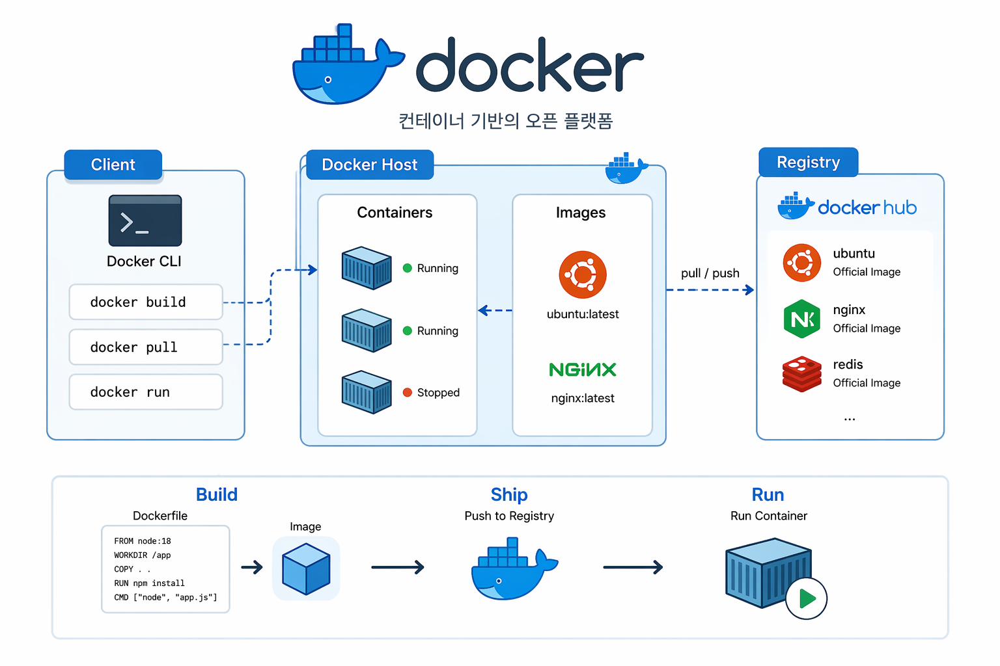

# Docker Repository

🔗 Blog: [Docker 자료](https://lucky-gun.com/tag/docker/)

이 저장소는 Docker 학습, 실습, 그리고 실제 운영 환경 구성을 기록한 공간입니다.

## 📂 Repository Structure

### 🧪 Practice (실습 & 실험)
| 디렉토리 | 설명 |
|----------|------|
| docker-infra-setup | docker를 이용한 구축 실습 |

---

### ⚡Prod (현재 운영중인 서버)
| 디렉토리 | 설명 |
|----------|------|
| my-website | docker 기반 블로그 배포 (현재 운영중) |

---
